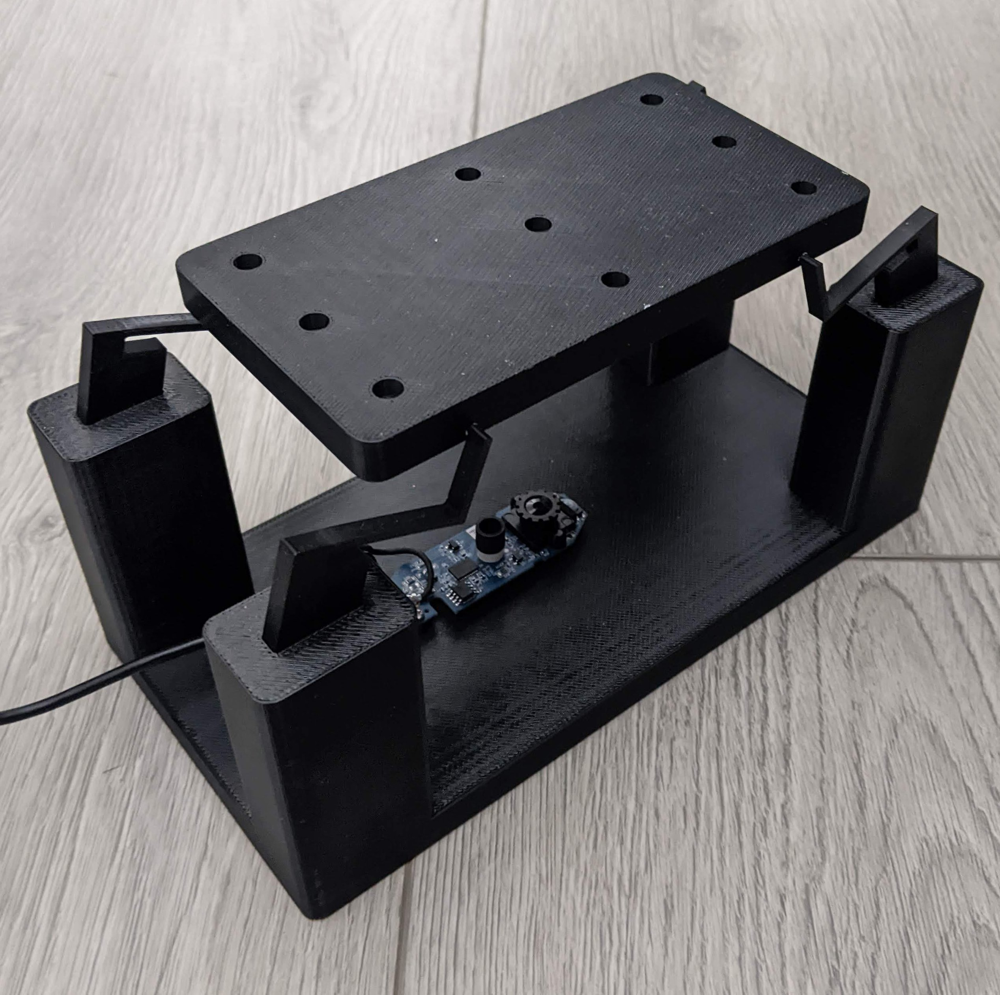
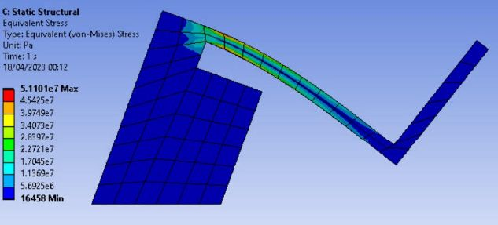
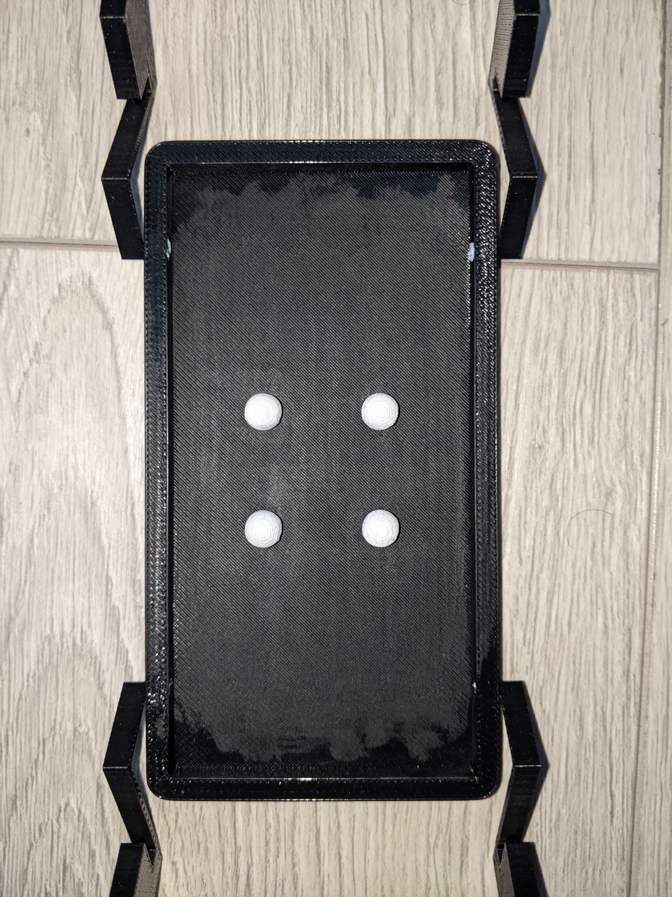
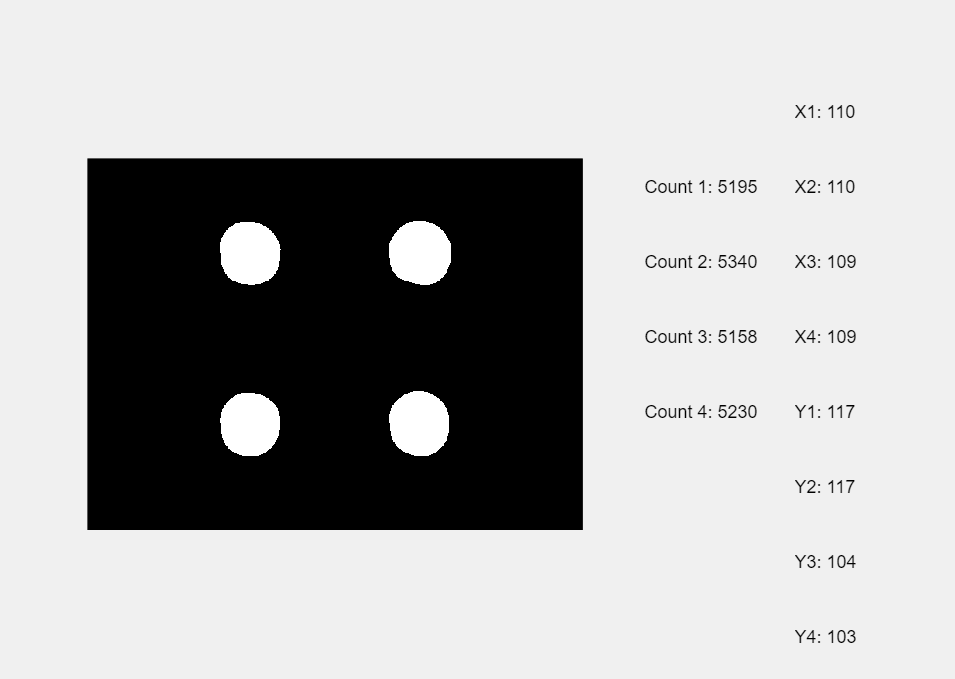
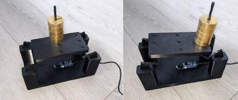
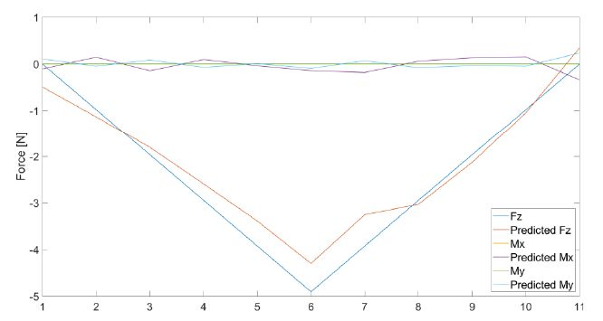

# Low-Cost Compliant Mechanism Scale: Optical Force Tracking

## Overview
This repository contains the software architecture, CAD, and datasets for my BEng Mechanical Engineering Dissertation. The project explores replacing expensive mechanical load cells with low-cost optical tracking using a standard webcam, compliant mechanisms, and image processing.

---

## 1. Design & Simulation
The scale utilises a 3D-printed compliant mechanism. Finite Element Analysis (FEA) was conducted to ensure the flexure legs operated within the elastic region of the PLA material, ensuring repeatability and preventing yielding.

| Physical Assembly | FEA Stress Analysis |
| :---: | :---: |
|  |  |

---

## 2. Optical Tracking & GUI
The system tracks planar displacements via high-contrast markers. The custom MATLAB GUI (`gui.m`) segments the live feed into four quadrants to calculate 12 state variables (pixel areas and centroid X/Y coordinates).

| Tracking Markers | MATLAB GUI Interface |
| :---: | :---: |
|  |  |

---

## 3. Mathematical Validation
Using Multiple Linear Regression (MLR) on 99 physical test samples, the system generates a $3 \times 12$ calibration matrix. This allows the scale to calculate absolute mass ($F_z$) while isolating bending moments ($M_x, M_y$) caused by off-centre loads.

| Eccentric Load Testing | Actual vs. Predicted Performance |
| :---: | :---: |
|  |  |

---

## 4. Documentation & Publications
This project was developed with high academic and scientific rigour, resulting in a full undergraduate dissertation and a drafted publication for *IEEE Sensors Letters*.

* 📄 **[IEEE Sensors Letters Publication](Documents/ieee_sensors_publication.pdf)**: A condensed, technical paper detailing the mathematical calibration and optical methodology.
* 📄 **[BEng Final Dissertation Report](Documents/final_dissertation_report.pdf)**: The complete 60+ page technical report covering the literature review, concept generation, FEA optimisation, and system validation.

---

## Repository Structure
* `/Scripts/` - Core MATLAB code.
* `/CAD/` - Manufacturing `.stl` and design `.step` files.
* `/Documents/` - Academic reports and publications.
* `ALL_IN_ONE.xlsx` - Raw 99-sample calibration dataset.
